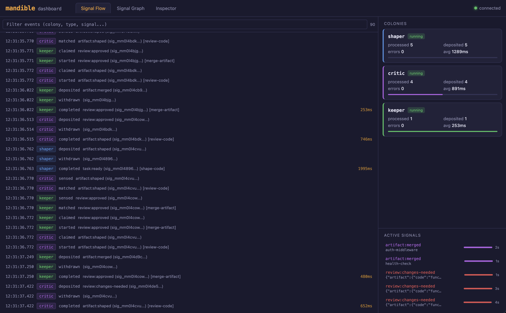
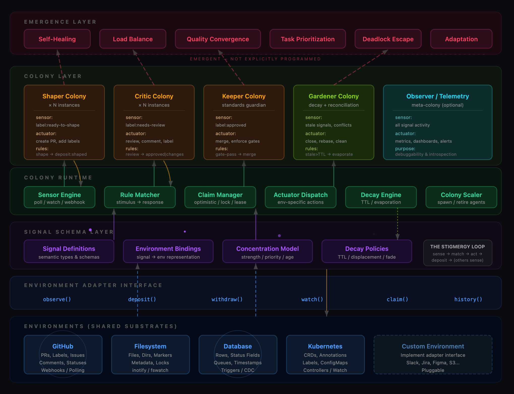

# Mandible


A universal stigmergy framework for autonomous agent coordination.

Instead of wiring agents together with message passing, Mandible agents coordinate by depositing and sensing **signals** in a shared **environment** — the same way ant colonies self-organize through pheromone trails. No orchestrator. No message routing. Complex behavior emerges from simple rules.

[mandible.dev](https://mandible.dev)

## Why stigmergy over message passing?

Most multi-agent frameworks coordinate agents through direct messaging. This reimplements distributed systems problems — service discovery, routing, consensus, backpressure — but for LLMs.

Stigmergy sidesteps all of that. The environment carries the state. Agents are stateless reactive workers. You never need to answer "who should I tell about this?" — you just modify the environment, and whoever cares will notice.

**What you get:**

- **Observability for free** — the environment *is* the log. `ls` the signals directory and see the full system state.
- **Fault tolerance** — an agent dies, the signal remains, another agent picks it up. No lost messages.
- **Zero coupling** — add or remove colony types without touching any existing colony's configuration.
- **Natural load balancing** — spin up more instances of any colony type. They self-organize around available work.
- **Provenance built in** — every signal is signed by the colony that produced it. Bridges attest transfers. Trust is verifiable.

## Quick start

```bash
npm install @mandible-ai/mandible
```

```typescript
import { mandible, FilesystemEnvironment } from '@mandible-ai/mandible';

const env = new FilesystemEnvironment({ root: './.mandible/signals' });

const host = await mandible('code-review')
  .environment(env)
  .colony('shaper', c => c
    .sense('task:ready', { unclaimed: true })
    .do('shape-code', async (signal, ctx) => {
      const result = await shapeCode(signal.payload);
      await ctx.deposit('artifact:shaped', result, { causedBy: [signal.id] });
      await ctx.withdraw(signal.id);
    })
    .concurrency(2)
    .claim('lease', 30_000)
  )
  .colony('critic', c => c
    .sense('artifact:shaped', { unclaimed: true })
    .do('review-code', async (signal, ctx) => {
      const review = await reviewCode(signal.payload);
      await ctx.deposit('review:approved', review, { causedBy: [signal.id] });
      await ctx.withdraw(signal.id);
    })
    .claim('exclusive')
  )
  .start();
```

No colony references any other colony. They coordinate entirely through signals in the environment.

### Hosting models

The **environment** (where signals live) is orthogonal to the **host** (where colony code runs). Colony definitions stay the same across all hosts — only the `.host()` call changes.

#### Local (default)

Runs colonies as Node runtimes in the current process. This is the default when `.host()` is omitted:

```typescript
import { mandible, FilesystemEnvironment } from '@mandible-ai/mandible';

const env = new FilesystemEnvironment({ root: './.mandible/signals' });

const host = await mandible('code-pipeline')
  .environment(env)
  .colony('shaper', shaper)
  .colony('critic', critic)
  .colony('keeper', keeper)
  .start();

await host.stop();
```

#### Docker

Runs each colony as a Docker container via the Mandible Cloud API:

```typescript
import { mandible, FilesystemEnvironment, docker } from '@mandible-ai/mandible';

const env = new FilesystemEnvironment({ root: './.mandible/signals' });

const host = await mandible('code-pipeline')
  .environment(env)
  .host(docker({
    apiUrl: process.env.MANDIBLE_API_URL!,
    apiKey: process.env.MANDIBLE_API_KEY!,
    image: 'mandible-colony:latest',
  }))
  .colony('shaper', shaper)
  .colony('critic', critic)
  .colony('keeper', keeper)
  .start();

console.log(host.metadata.projectId);
await host.stop();
```

#### Cloud (Edera microVMs)

For production workloads, run colonies in isolated Edera zones via [Mandible Cloud](https://mandible.dev):

```typescript
import { mandible, FilesystemEnvironment } from '@mandible-ai/mandible';
import { cloud } from '@mandible-ai/cloud';

const env = new FilesystemEnvironment({ root: './.mandible/signals' });

const host = await mandible('code-pipeline')
  .environment(env)
  .host(cloud({ apiKey: process.env.MANDIBLE_API_KEY!, project: 'code-review' }))
  .colony('shaper', shaper)
  .colony('critic', critic)
  .colony('keeper', keeper)
  .start();

await host.stop();
```

Same colonies, same environment, different host.

### Run with the dashboard

The fastest way to see colonies in action is the CLI:

```bash
mandible dev examples/repo-maintenance/mandible.config.ts
```

This starts all colonies and opens the live dashboard at `localhost:4040`. See the [Dashboard](#dashboard) section for details.

A ready-made demo is available:

```bash
npm run demo:repo-maintenance
```

## Dashboard

`mandible dev <config>` runs your colonies and opens a live dashboard in the browser.

- Real-time signal flow — watch signals appear, get claimed, and cascade through colonies
- Colony status cards — running state, concurrency, claim counts, heartbeat health
- WebSocket streaming — updates push instantly, no polling

```bash
mandible dev mandible.config.ts              # default: localhost:4040
mandible dev mandible.config.ts --port 8080  # custom port
mandible dev mandible.config.ts --no-open    # skip auto-opening browser
```



## Architecture



## Core concepts

Every concept maps to a biological analogy:

| Mandible | Biology | Description |
|----------|---------|-------------|
| **Signal** | Pheromone | A typed marker deposited in the environment with a payload, concentration, and TTL. |
| **Environment** | Substrate | The shared medium agents read from and write to. Filesystem, GitHub, Remote, Dolt. |
| **Colony** | Ant caste | A group of identical agents with shared sensors, rules, and claim strategy. |
| **Sensor** | Antennae | How a colony perceives signals. A query pattern like `task:ready` or `review:*`. |
| **Rule** | Instinct | A stimulus→response mapping: "when I sense X, do Y and deposit Z." |
| **Concentration** | Pheromone strength | Signal priority (1.0 → 0.0). Agents prioritize stronger signals. |
| **Decay** | Evaporation | Signals weaken over time, preventing stale work from accumulating. |
| **Colony Identity** | Colony scent | Ed25519 keypair. Every signal is signed by the colony that produced it. |
| **Attestation** | Trail markers | Bridges sign transfers, creating a verifiable chain of custody across environments. |
| **Sentinel** | Guard ant | Monitors an environment for signals that fail provenance verification. |

## The stigmergy loop

Every colony runtime executes the same loop:

```
sense → match rules → claim → execute action → deposit → (others sense)
```

1. **Sense** — poll or watch the environment for signals matching the colony's sensor queries.
2. **Match** — evaluate rules against sensed signals, ordered by priority.
3. **Claim** — attempt to claim the signal (prevents duplicate work across concurrent agents).
4. **Act** — execute the matched rule's action (LLM call, shell command, custom function).
5. **Deposit** — leave new signed signals in the environment as output.

Other colonies sense those deposited signals and the cycle continues. Complex workflows emerge from simple local rules.

## Mandible DSL

The `mandible()` function is the top-level entry point for defining and starting multi-colony systems:

```typescript
const host = await mandible('my-swarm')
  .environment(env)                               // where colonies operate
  .colony('name', c => c                          // define a colony inline
    .sense('type:pattern', { unclaimed: true })   // what to watch for
    .do('action-name', handler)                   // what to do
    .concurrency(3)                               // max parallel agents
    .claim('lease', 30_000)                       // claim strategy
  )
  .start();                                       // start everything
```

`start()` delegates to the host — `local()` starts Node runtimes in the current process, `docker()` launches containers, `cloud()` launches Edera microVMs. Returns the host for lifecycle control (`host.stop()`, `host.dashboard()`).

### Colony builder

For lower-level control, use the `colony()` builder directly:

```typescript
colony('name')
  .in(env)                                        // which environment
  .sense('type:pattern', { unclaimed: true })     // what to watch for
  .when(signal => signal.payload.priority > 0)    // optional guard
  .do('shape', withClaudeCode({                   // action provider
    prompt: signal => `Implement: ${signal.payload.name}`,
    allowedTools: ['Read', 'Write'],
  }))
  .concurrency(3)                                 // max parallel agents
  .claim('lease', 30_000)                         // claim strategy
  .poll(2000)                                     // sensor poll interval (ms)
  .heartbeat(10_000)                              // periodic alive signals
  .autoWithdraw()                                 // auto-remove processed signals
  .timeout(60_000)                                // action timeout
  .retry(3, 1000)                                 // retry with backoff
  .build();
```

**Claim strategies:**

| Strategy | Behavior |
|----------|----------|
| `exclusive` | Strict claim-before-work. Only one agent processes each signal. |
| `lease` | Claim with TTL. Auto-releases if the agent dies or times out. |
| `optimistic` | Let multiple agents start, reconcile after. |
| `none` | No claiming. Multiple agents may process the same signal. |

## Action providers

Action providers wrap external capabilities into a standard interface for colony rules.

| Provider | Use case | Backed by |
|----------|----------|-----------|
| `withClaudeCode` | Coding agents, complex reasoning | Claude Code SDK (live) |
| `withStructuredOutput` | Classification, review, decisions | Anthropic, OpenAI, Vercel AI SDK |
| `withBash` | Build commands, test runners, linters | Shell execution |

`withClaudeCode` is fully wired to the Claude Code SDK — colonies spawn real agent sessions that read files, write code, and run commands. It supports **AWS Bedrock routing** via the `bedrock` config option for enterprise deployments.

The provider assembles context by walking signal lineage (`caused_by` chains), giving the agent full awareness of the work pipeline state.

## Signal types

Signal types use a `domain:state` convention and support glob patterns for sensing:

```typescript
'task:ready'        // exact match
'task:*'            // any task signal
'*:ready'           // anything in the ready state
'review:*'          // any review signal
```

## Trust and attestation

Mandible provides cryptographic provenance for signals using `@noble/ed25519`:

- **Colony signing** — each colony generates an Ed25519 keypair and signs every signal it deposits. Signatures cover the semantic content (type, payload, lineage) but not mutable state (concentration, timestamps).
- **Bridge attestation** — when a signal crosses environments via a bridge, the bridge appends a signed attestation. Each attestation signs over the previous, creating a linked chain of custody.
- **Trust levels** — signals are classified as `verified` (valid signature + chain), `attested` (bridge chain valid, origin unsigned), `unverified` (no provenance), or `rejected` (verification failed).
- **Sentinel colonies** — monitor an environment for trust violations and deposit report signals that other colonies can react to.

## Environment adapters

Any shared substrate that supports observe/deposit/withdraw/claim/watch can be a Mandible environment.

### Filesystem (implemented)

Signals are JSON files. Claims use atomic file operations. History lives in a `withdrawn/` directory.

```typescript
import { FilesystemEnvironment } from '@mandible-ai/mandible';

const env = new FilesystemEnvironment({
  root: './.mandible/signals',
  name: 'local',
});
```

### GitHub (implemented)

Issues, pull requests, comments, and labels mapped as signals. Colonies can sense repository activity and deposit responses.

```typescript
import { GitHubEnvironment } from '@mandible-ai/mandible';

const env = new GitHubEnvironment({
  owner: 'mandible-ai',
  repo: 'mandible',
  token: process.env.GITHUB_TOKEN,
});
```

### Dolt (stubbed)

[Dolt](https://www.dolthub.com/) is a SQL database with Git-like versioning. Signals become rows, branching enables parallel work, and `dolt_history` provides queryable time travel for the full signal history.

### Writing your own

Implement the `Environment` interface:

```typescript
interface Environment {
  name: string;
  observe(query: SignalQuery): Promise<Signal[]>;
  deposit(signal): Promise<Signal>;
  withdraw(signalId: string): Promise<void>;
  claim(signalId: string, claimant: string, leaseDuration?: number): Promise<boolean>;
  release(signalId: string): Promise<void>;
  watch(query: SignalQuery, callback: (signal: Signal) => void): Subscription;
  history(query: SignalQuery): Promise<Signal[]>;
  decay(): Promise<DecayResult>;
  snapshot(): Promise<Signal[]>;
}
```

Hosts are orthogonal to Environments. To run colonies somewhere other than the local process, implement the `Host` interface:

```typescript
interface Host {
  name: string;
  start(colonies: ColonyDefinition[]): Promise<void>;
  stop(): Promise<void>;
  dashboard(options?: DashboardOptions): Promise<void>;
  metadata: HostMetadata;
  colonies: Array<{ name: string; state: string }>;
  environments: Environment[];
}
```

Built-in hosts: `local()` (in-process), `docker()` (containers). Cloud hosts live in `@mandible-ai/cloud`.

## Patterns

Reusable coordination patterns built on top of the core primitives.

### SignalBridge

Cross-environment signal mirroring with attestation chains. Bridges watch for signals in one environment and mirror them to another, appending a signed attestation to preserve provenance across boundaries.

```typescript
import { createBridge } from '@mandible-ai/mandible';

const bridge = createBridge({
  name: 'local-to-github',
  identity: bridgeIdentity,
  source: localEnv,
  target: githubEnv,
  signalTypes: ['fix:proposed'],
});
await bridge.start();
```

### Sentinel

Trust monitoring colony that watches an environment for signals with invalid or missing provenance. When violations are detected, the sentinel deposits `trust:violation` report signals that other colonies can react to.

```typescript
import { createSentinel } from '@mandible-ai/mandible';

const sentinel = createSentinel({
  name: 'trust-guard',
  environment: env,
  policy: { name: 'strict', defaultTrust: 'unverified', minimumTrust: 'verified' },
});
await sentinel.start();
```

## Project structure

```
src/
  cli/
    index.ts            CLI entry point — `mandible dev`
    server.ts           Dashboard HTTP + WebSocket server
    dashboard.html      Live dashboard UI
  cloud/
    index.ts            Cloud client for hosted observability
  core/
    types.ts            Core type system (Signal, Environment, Colony, Trust)
    signal.ts           Signal creation, matching, decay, priority sorting
    runtime.ts          Colony runtime — the stigmergy loop engine
    attestation.ts      Ed25519 signing & verification (@noble/ed25519)
  dsl/
    builder.ts          Fluent colony definition DSL
    mandible.ts         mandible() — multi-colony orchestration + start
  environments/
    filesystem/         Filesystem adapter (JSON files + atomic claims)
    github/             GitHub adapter (issues, PRs, comments, labels as signals)
    dolt/               Dolt adapter (stub)
  hosts/
    local.ts            LocalHost — runs colonies in current process
    docker.ts           DockerHost — runs colonies as Docker containers
  providers/
    claude-code.ts      withClaudeCode — Claude Code SDK (live)
    structured-output.ts withStructuredOutput — multi-model
    bash.ts             withBash — shell commands
    context.ts          Context assembly from signal lineage
  patterns/
    bridge.ts           SignalBridge — cross-environment mirroring with attestation
    sentinel.ts         Sentinel — trust monitoring and violation reporting

tests/
  core/                 Signal, runtime, attestation tests
  environments/         Filesystem, GitHub adapter tests
  dsl/                  DSL and mandible() builder tests
  providers/            Agent, structured output, bash provider tests
  colonies/             Integration tests for colony workflows

examples/
  code-pipeline/
    colonies.ts         Shared colony definitions (shaper, critic, keeper)
    index.ts            Local host — runs in current process
    docker.ts           Docker host — runs as containers
    with-providers.ts   Real LLM providers (Claude Code, Anthropic, Bash)
  repo-maintenance/     Scout + Fixer repo maintenance demo
```

## Examples

### Code pipeline

Three colonies coordinate through a shared filesystem environment:

- **Shaper** (concurrency: 2) — picks up `task:ready` signals, produces `artifact:shaped`
- **Critic** (concurrency: 2) — reviews shaped artifacts, deposits `review:approved` or `review:changes-needed`
- **Keeper** (concurrency: 1) — merges approved work, deposits `artifact:merged`

Colony definitions live in `colonies.ts` and are shared across all hosting modes:

```bash
# Local host (default)
npx tsx examples/code-pipeline/index.ts

# Docker host
export MANDIBLE_API_URL=http://localhost:9091
export MANDIBLE_API_KEY=your-key
npx tsx examples/code-pipeline/docker.ts

# With real LLM providers
export ANTHROPIC_API_KEY=sk-ant-...
npx tsx examples/code-pipeline/with-providers.ts
```

### Repo maintenance

Scout + Fixer colony pair that maintain a repository. Run it against any repo:

- **Scout** — scans the repository for issues, deposits `issue:detected` signals (one per finding, categorized by severity)
- **Fixer** — claims `issue:detected` signals, applies fixes, deposits `fix:proposed` or `fix:failed`

```bash
npm run demo:repo-maintenance
```

Both colonies are wired to real Claude agents via `withClaudeCode`. The dashboard shows signal flow in real time.

## Roadmap

- [x] `mandible dev` CLI + live dashboard
- [x] `withClaudeCode` wired to Claude Code SDK
- [x] Test suite (378 tests, 95%+ coverage)
- [x] GitHub environment adapter
- [x] `mandible()` DSL with Host/Environment separation
- [x] `local()` and `docker()` host implementations
- [ ] `@mandible-ai/cloud` — run colonies in Edera microVMs via Mandible Cloud
- [ ] `create-mandible` starter template
- [ ] Dashboard GIF + landing page
- [ ] Dolt full implementation
- [ ] CloudEvents bridge adapter
- [ ] Colony scaler
- [ ] Trust enforcement
- [ ] Hosted observability platform

## License

MIT
